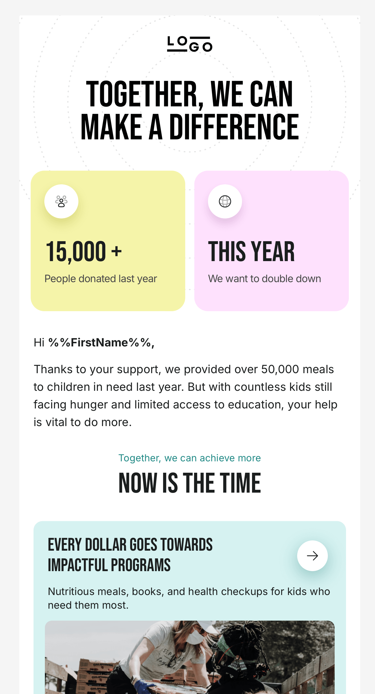
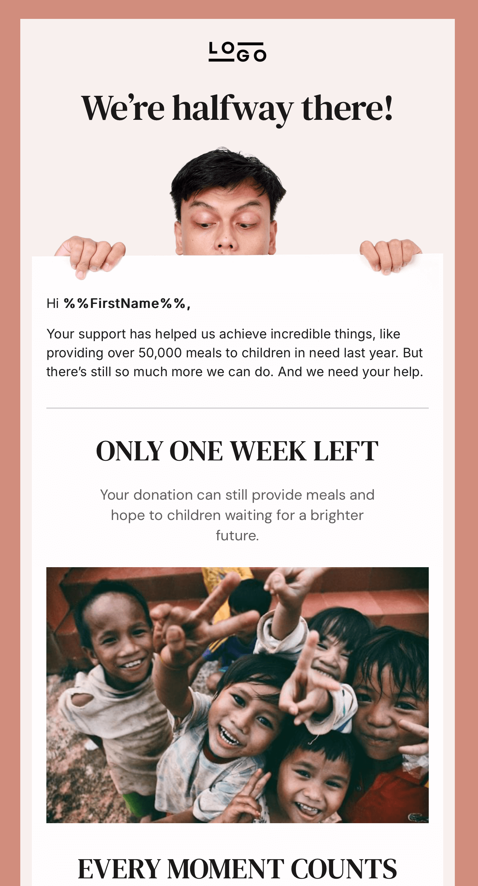
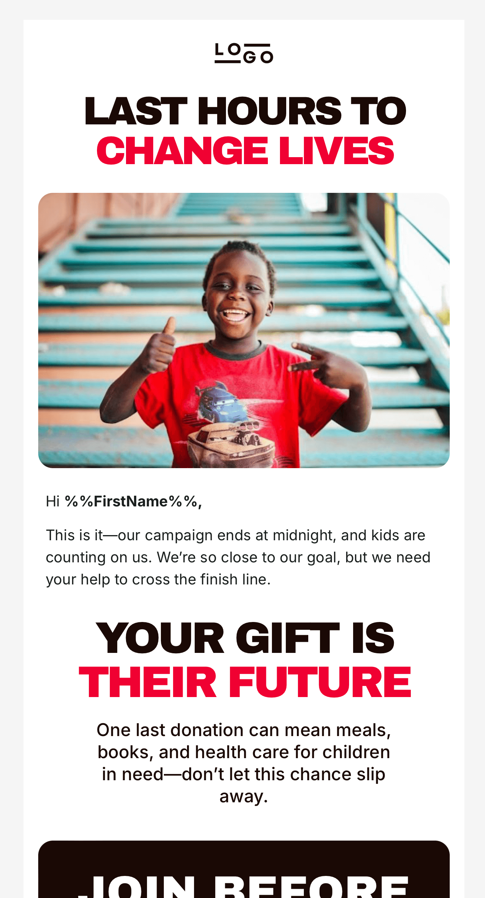

# Emails and Strategy Plan

### Emails
<table border="0">
   <tr>
      <td align="center">
          
         <a href="funding_1/index.html">View</a> | 
         <a href="funding_1/index.html">HTML</a>
      </td>
      <td align="center">
          
         <a href="funding_2/index.html">View</a> | 
         <a href="funding_2/index.html">HTML</a>
      </td>
      <td align="center">
          
         <a href="funding_3/index.html">View</a> | 
         <a href="funding_3/index.html">HTML</a>
      </td>
   </tr>
</table>

### Goal 
Raise money by June 30, 2025 for children’s education and health programs.

### Audience
Assumed mix of past donors and new prospects, segmented on typical fundraising lists (e.g., prior givers, event attendees, community contacts).

### Timeline
- June 16: Intro email (“Together We Can…”).
- June 23: Reminder email (“Your Chance…”).
- June 30: Last chance email (“Last Hours…”).

### Approach
#### Email 1
Bright and informational design to grab attention and ensure memorability, using bold titles and clear impact stats.

#### Email 2
Halfway reminder with warmer colors (e.g., oranges, yellows), building momentum and prepping for the final push.

#### Email 3
Strong red, black, and white design with a red CTA button, emphasizing urgency and finality.

### Testing Plan

**If existing templates**, test this sequence against current ones:
- 10% old template, 
- 10% new sequence, 
- then scale the winner (higher open/conversion rate) to the remaining 80%.

**If no existing templates**, create variations of this sequence (e.g., tweak titles, CTAs): 
- test 10% each, and 
- deploy the winner to 80%, tracking open and conversion rates to optimize.

### Metrics
Target 20% open rate and 5% click-to-donate rate per email as a starting benchmark, based on industry averages for nonprofit campaigns (adjustable with real data post-test).